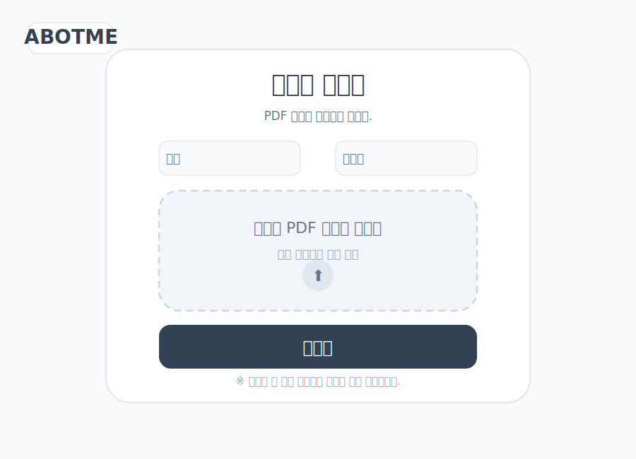
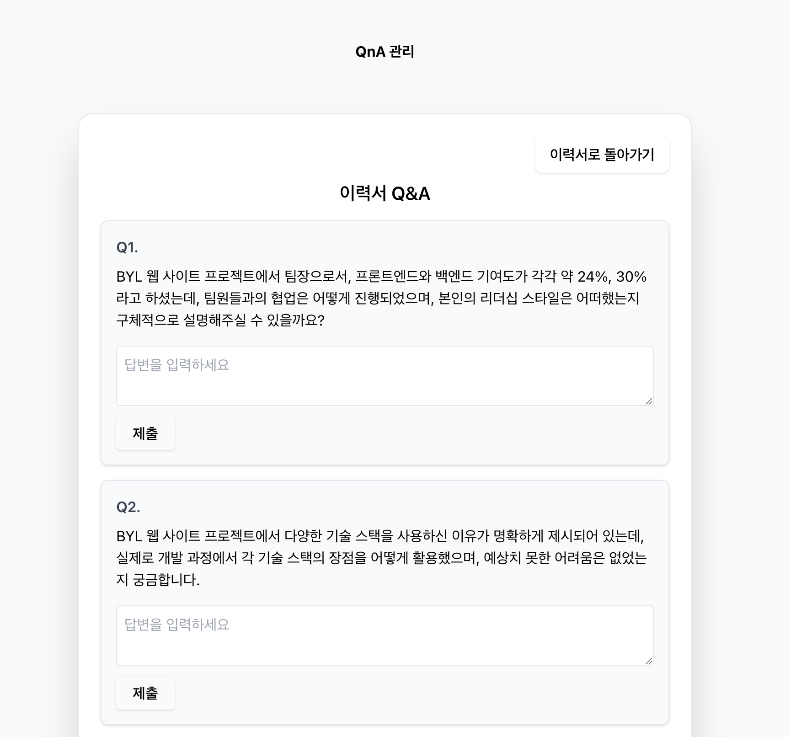
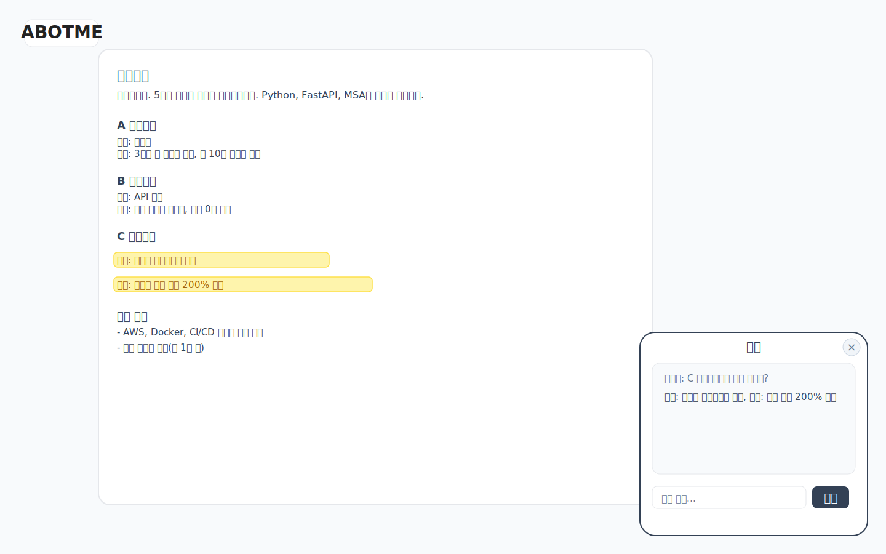

# LLM 기반 이력서 어플리케이션 설계서 (2025-07-27 최신)

## 1. 서비스 목적
- 채용담당자가 이력서에서 확인하기 어려운 기술적/개인적 정보를 LLM 기반 질문과 답변을 통해 심층적으로 탐색할 수 있도록 지원

## 2. 전체 프로세스 도식


- **이력서 업로드**: PDF drag & drop, 이름/이메일 입력
- **질문 생성/답변**: LLM 기반 자동 질문 생성, 질문별 답변/저장
- **이력서 보기 & 챗봇**: PDF 전체 렌더링, 챗봇, 질문 관련 하이라이트

---

## 3. 주요 화면 와이어프레임

- **이력서 업로드**
<svg>

</svg>
- **질문 생성/답변**
<svg>

</svg>

- **이력서+챗봇**
<svg>

</svg>

---

## 4. API 엔드포인트 요약


| Method | Endpoint | 권한 | 설명 |
|--------|----------|------|------|
| POST   | /resume/ | 전체 | 이력서 업로드/등록 (PDF, 이름, 이메일) |
| GET    | /resume/ | 전체 | 이력서 조회 |
| POST   | /resume/generate-questions | 관리자 | 이력서 기반 질문 생성 |
| GET    | /resume/questions/ | 전체 | 질문 리스트 조회 |
| GET    | /resume/questions/{question_id}/ | 전체 | 질문 조회 |
| POST   | /resume/questions/{question_id}/answer/ | 관리자 | 답변 저장(1대1, edit_token 필요) |
| GET    | /resume/answers/{question_id}/ | 전체 | 답변 조회 |
| POST   | /chat/ | 전체 | 챗봇 대화 (Resume 기반 RAG) |
| POST   | /chat/graph/ | 전체 | 그래프 기반 챗봇 대화 |
| GET    | /faq/ | 전체 | FAQ 리스트 조회 |
| GET    | /history/{session_id}/ | 전체 | 세션별 대화 히스토리 조회 |
| POST   | /vector-store/pdf/ | 관리자 | PDF를 벡터스토어로 변환 (임시 업로드)
| POST   | /token/verify/ | 전체 | edit_token 유효성 검사 |
| GET    | /pdf/?fname={fname} | 전체 | PDF 파일 프론트엔드 전송용 |
| POST   | /resume/generate-questions | 관리자 | 질문 자동 생성 |
| GET    | /resume/questions/{question_id} | 관리자 | 단일 질문 조회 |
| POST   | /resume/questions/{question_id}/answer | 관리자 | 답변 저장(1대1) |

---

## 5. 보안/운영 주의사항
- edit_token은 안전하게 저장/전송, 공개 URL에는 절대 포함하지 말 것
- 관리자 endpoint는 edit_token 미포함 시 403 반환
- 공개 endpoint는 누구나 접근 가능

---


## 6. 프로젝트 구조
```
AbotMe/
├── backend/           # FastAPI 백엔드
│   ├── app/          # 애플리케이션 코드
│   │   ├── main.py   # FastAPI 앱
│   │   ├── dependencies.py   # 의존성 관리
│   │   ├── data_pipeline/  # 데이터 파이프라인
│   │   ├── database/  # 데이터베이스 관련 코드
│   │   ├── llm/  # LLM 관련 코드
│   │   ├── routers/  # API 라우터
│   │   ├── models/   # 데이터 모델
│   │   └── services/ # 비즈니스 로직
│   ├── tests/        # 테스트 코드
│   ├── .venv/        # 가상환경
│   └── requirements.txt
├── frontend/         # React 프론트엔드
│   ├── src/         # 소스 코드
│   │   ├── App.js # 애플리케이션
│   │   ├── api/  # API 호출
│   │   ├── components/  # 컴포넌트
│   │   └── pages/  # 페이지
│   ├── public/      # 정적 파일
│   └── package.json
├── docs/             # 문서
├── .github/          # GitHub Actions
├── Makefile          # 개발 프로세스 자동화
└── docker-compose.yml
```

---

## 8. 데이터 흐름

### 1) 이력서 업로드 프로세스

| 단계 | 설명 |
|------|------|
| 1    | 사용자가 이력서(PDF) 업로드 및 기본 정보 입력 |
| 2    | 서버에서 PDF 정보 추출 (텍스트, 메타데이터 등) |
| 3    | LLMGraphTransformer를 사용해 이력서 정보를 그래프 데이터로 변환 및 저장 |
---

### 2) 챗봇 질의 프로세스

| 단계 | 설명 |
|------|------|
| 1    | 사용자가 챗봇에 질문 입력 |
| 2    | 질문을 그래프 쿼리로 변환 |
| 3    | 그래프 쿼리 결과를 RAG 프롬프트의 컨텍스트로 제공 |
| 4    | LLM이 답변 생성 및 반환 |


## 9. 모니터링 및 로깅
- Langfuse 등으로 사용자 행동 모니터링
- 질문 패턴, 자주 사용 기능, 오류 발생 패턴 등 분석

