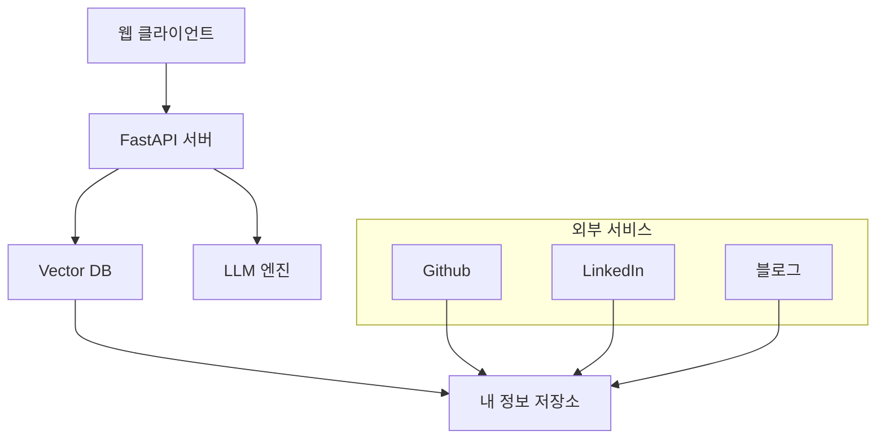
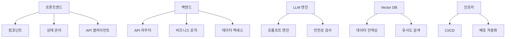
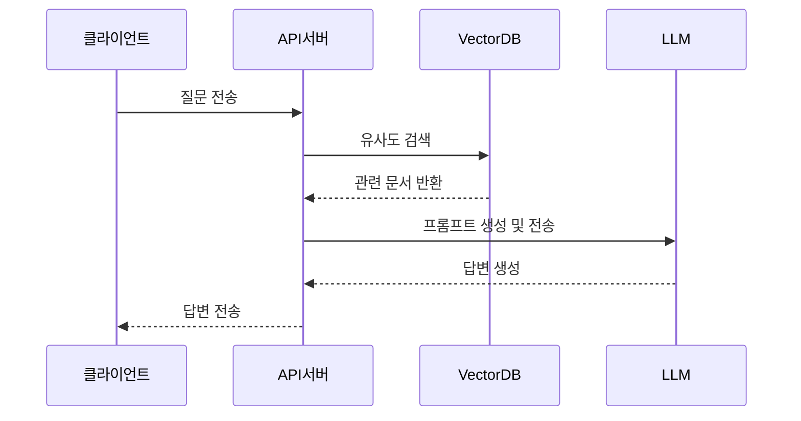
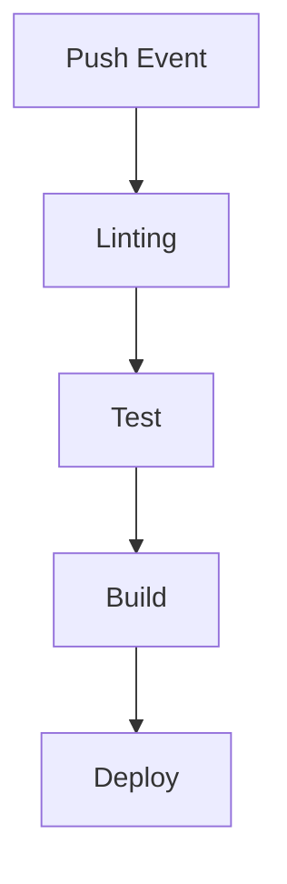

# 시스템 설계 문서

## 1. 시스템 아키텍처

## 2. 기술 스택
### 프론트엔드
- React + TypeScript
- Tailwind CSS
- Shadcn/ui
- react-hook-form

### 백엔드
- FastAPI
- Python 3.11+
- uv (Python 라이브러리 관리)

### LLM
- Langchain

### 데이터베이스
- ChromaDB (Vector DB)
- SQLite (메타데이터 저장)

### 인프라
- Docker
- GitHub Pages
- GitHub Actions

## 3. 컴포넌트 구조

## 4. 데이터 흐름

## 5. 배포 전략
### CI/CD 파이프라인

### 배포 환경
- 개발: 로컬 Docker
- 테스트: GitHub Actions
- 프로덕션: GitHub Pages

## 6. 보안 고려사항
1. 입력 검증
   - XSS 공격 방지
   - SQL Injection 방지
   - LLM 안전성 검사

2. API 보안
   - Rate limiting
   - API 키 관리

3. 데이터 보안
   - 민감 정보 암호화
   - 로그 관리
   - 접근 제어

## 7. 모니터링 및 로깅
### 사용자 행동 모니터링
   - Langfuse를 활용하여 사용자 질문을 모니터링한다.
   - 질문 패턴 분석
   - 자주 사용되는 기능
   - 오류 발생 패턴
