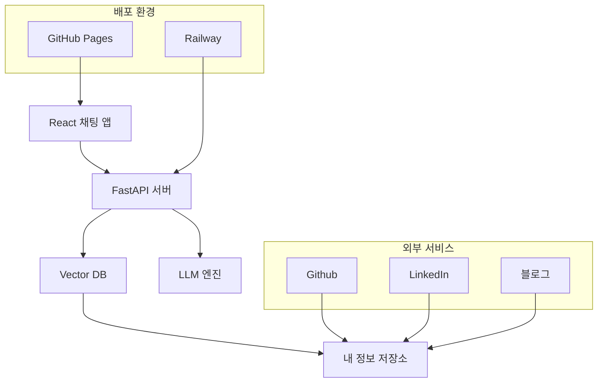
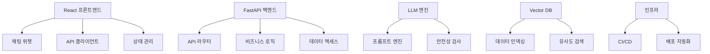
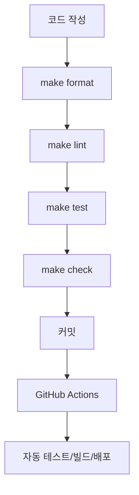
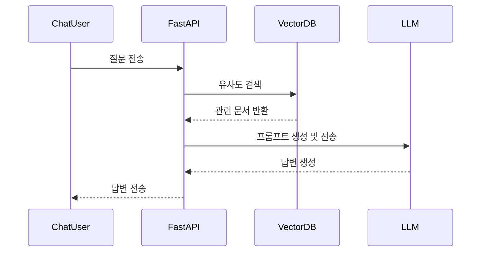
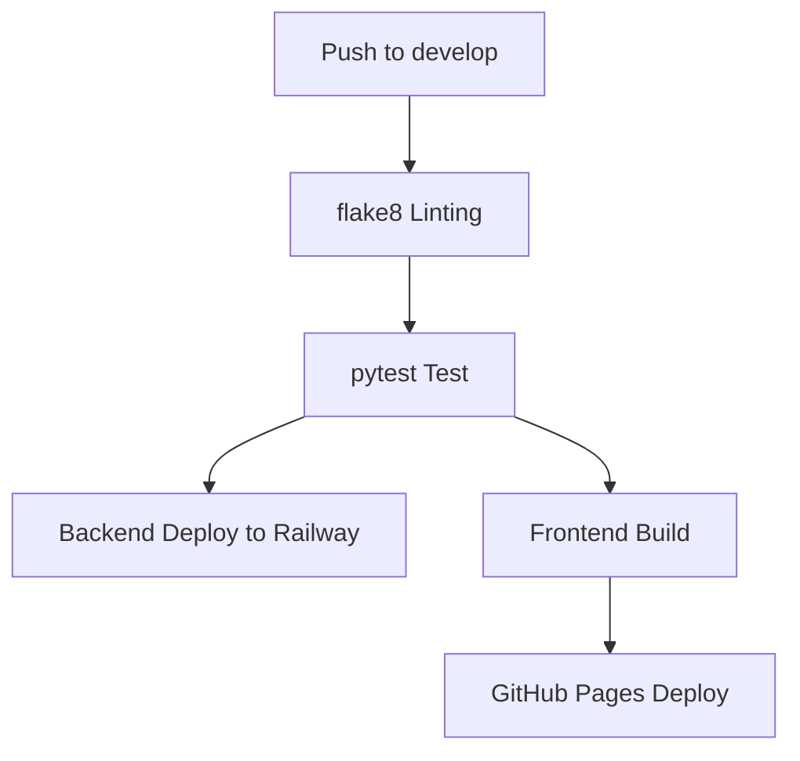

# 시스템 설계 문서

## 1. 시스템 아키텍처


## 2. 기술 스택
### 프론트엔드
- React + TypeScript
- react-chat-widget (채팅 위젯)
- GitHub Pages (정적 배포)

### 백엔드
- FastAPI
- Python 3.12+
- uv (Python 라이브러리 관리)

### LLM
- Langchain

### 데이터베이스
- ChromaDB (Vector DB)
- SQLite (메타데이터 저장)

### 인프라
- Railway (백엔드 배포)
- GitHub Pages (프론트엔드 배포)
- GitHub Actions

## 3. 컴포넌트 구조


## 4. 프로젝트 구조
```
AbotMe/
├── backend/           # FastAPI 백엔드
│   ├── app/          # 애플리케이션 코드
│   │   ├── main.py   # FastAPI 앱
│   │   ├── routers/  # API 라우터
│   │   ├── models/   # 데이터 모델
│   │   └── services/ # 비즈니스 로직
│   ├── tests/        # 테스트 코드
│   ├── .venv/        # 가상환경
│   └── requirements.txt
├── frontend/         # React 프론트엔드
│   ├── src/         # 소스 코드
│   ├── public/      # 정적 파일
│   └── package.json
├── docs/             # 문서
├── .github/          # GitHub Actions
├── Makefile          # 개발 프로세스 자동화
└── docker-compose.yml
```

## 5. 개발 프로세스
### 코드 품질 관리


### Makefile 명령어
- `make install`: 백엔드 의존성 설치
- `make lint`: flake8 코드 검사
- `make test`: pytest 테스트 실행
- `make check`: lint + test 전체 검사
- `make format`: black 코드 포맷팅
- `make clean`: 캐시 파일 정리

## 6. 데이터 흐름


## 7. 배포 전략
### CI/CD 파이프라인


### 배포 환경
- **프론트엔드**: GitHub Pages (정적 사이트)
- **백엔드**: Railway (Python 웹 서비스)
- **개발**: 로컬 환경

## 8. 보안 고려사항
1. 입력 검증
   - XSS 공격 방지
   - SQL Injection 방지
   - LLM 안전성 검사

2. API 보안
   - Rate limiting
   - API 키 관리
   - CORS 설정

3. 데이터 보안
   - 민감 정보 암호화
   - 로그 관리
   - 접근 제어

## 9. 모니터링 및 로깅
### 사용자 행동 모니터링
   - Langfuse를 활용하여 사용자 질문을 모니터링한다.
   - 질문 패턴 분석
   - 자주 사용되는 기능
   - 오류 발생 패턴
