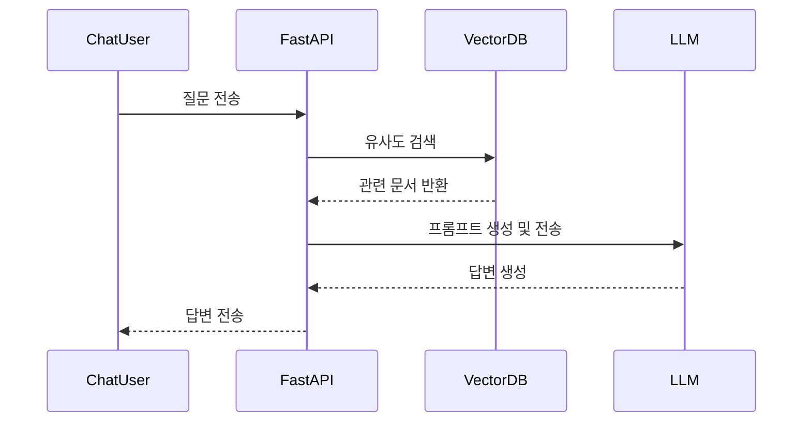
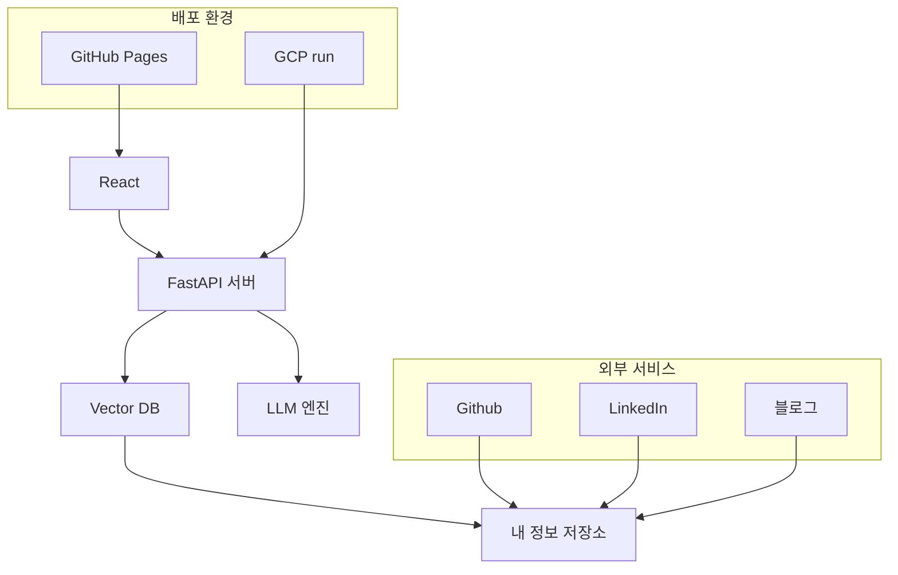
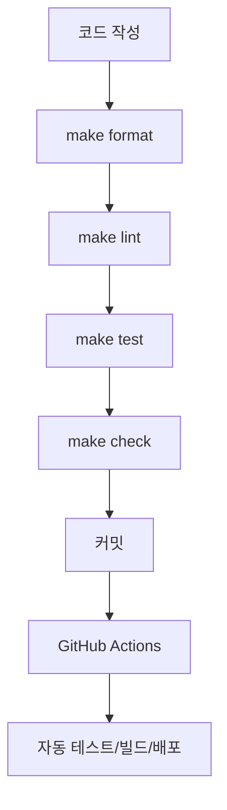

# LLM 기반 이력서 어플리케이션 설계서 (2025-07-10 최신)

## 1. 서비스 목적
- 채용담당자가 이력서에서 확인하기 어려운 기술적/개인적 정보를 LLM 기반 질문과 답변을 통해 심층적으로 탐색할 수 있도록 지원

## 2. 전체 프로세스 도식


- **이력서 업로드**: PDF drag & drop, 이름/이메일 입력
- **질문 생성/답변**: LLM 기반 자동 질문 생성, 질문별 답변/저장, 미입력 시 워닝
- **이력서 보기 & 챗봇**: PDF 전체 렌더링, 챗봇, 질문 관련 하이라이트

---

## 3. 주요 화면 와이어프레임

- **이력서 업로드**: [frontend_wireframe_upload.svg](images/frontend_wireframe_upload.svg)
- **질문 생성/답변**: [frontend_wireframe_questions.svg](images/frontend_wireframe_questions.svg)
- **이력서+챗봇**: [frontend_wireframe_resume_chat.svg](images/frontend_wireframe_resume_chat.svg)

---

## 4. API 엔드포인트 요약

| Method | Endpoint | 권한 | 설명 |
|--------|----------|------|------|
| POST   | /resume | (최초) | 이력서 업로드/등록 |
| GET    | /resume | 전체 | 이력서/질문/답변 데이터 조회 |
| POST   | /resume/generate-questions | 관리자 | 질문 자동 생성 |
| GET    | /resume/questions/{question_id} | 관리자 | 단일 질문 조회 |
| POST   | /resume/questions/{question_id}/answer | 관리자 | 답변 저장(1대1) |
| POST   | /resume/chat | 전체 | 챗봇 질의 |
| GET    | /resume/{resume_id} | 전체 | 이력서/챗봇 데이터 조회 |
| POST   | /resume/{resume_id}/chat | 전체 | 챗봇 질의 |

---

## 5. 보안/운영 주의사항
- edit_token은 안전하게 저장/전송, 공개 URL에는 절대 포함하지 말 것
- 관리자 endpoint는 edit_token 미포함 시 403 반환
- 공개 endpoint는 누구나 접근 가능

---

## 6. 기술 스택 및 시스템 아키텍처
### 프론트엔드
- React + TypeScript
- TailwindCSS, shadcn/ui
- GitHub Pages (정적 배포)

### 백엔드
- FastAPI (Python 3.12+)
- uv (Python 라이브러리 관리)
- GCP run (배포)

### LLM/DB
- Langchain
- ChromaDB (Vector DB)
- SQLite (메타데이터 저장)

### 인프라
- GCP run (백엔드 배포)
- GitHub Pages (프론트엔드 배포)
- GitHub Actions

### 기타
- GitHub Actions (CI/CD)
- PDF.js (프론트 PDF 렌더링)

---

## 7. 프로젝트 구조
```
AbotMe/
├── backend/           # FastAPI 백엔드
│   ├── app/          # 애플리케이션 코드
│   │   ├── main.py   # FastAPI 앱
│   │   ├── routers/  # API 라우터
│   │   ├── models/   # 데이터 모델
│   │   └── services/ # 비즈니스 로직
│   ├── tests/        # 테스트 코드
│   ├── .venv/        # 가상환경
│   └── requirements.txt
├── frontend/         # React 프론트엔드
│   ├── src/         # 소스 코드
│   ├── public/      # 정적 파일
│   └── package.json
├── docs/             # 문서
├── .github/          # GitHub Actions
├── Makefile          # 개발 프로세스 자동화
└── docker-compose.yml
```

---

## 8. 데이터 흐름


---

## 9. 배포/운영 전략
- **프론트엔드**: GitHub Pages (정적 사이트)
- **백엔드**: GCP cloud run
- **개발**: 로컬 환경
- GitHub Actions 통한 CI/CD 자동화

---

## 10. UI/UX/컴포넌트 설계 포인트
- 모든 SVG/와이어프레임은 Figma, VSCode, 브라우저 등에서 확인 가능
- Tailwind CSS, shadcn/ui 스타일 기반 컴포넌트 구현 권장
- PDF.js 등과 연동 시 하이라이트는 줄 단위 overlay로 구현
- 업로드/질문/답변 등은 Dialog, Stepper 등으로 모달 처리
- 이력서 뷰어와 챗봇은 항상 메인 페이지에 노출
- 업로드/수정/답변 UI는 관리자 URL에서만 노출

---

## 11. 보안 고려사항
1. 입력 검증: XSS, SQL Injection, LLM 안전성 검사
2. API 보안: Rate limiting, API 키, CORS
3. 데이터 보안: 민감 정보 암호화, 로그 관리, 접근 제어

---

## 12. 모니터링 및 로깅
- Langfuse 등으로 사용자 행동 모니터링
- 질문 패턴, 자주 사용 기능, 오류 발생 패턴 등 분석


## 1. 시스템 아키텍처



## 4. 프로젝트 구조
```
AbotMe/
├── backend/           # FastAPI 백엔드
│   ├── app/          # 애플리케이션 코드
│   │   ├── main.py   # FastAPI 앱
│   │   ├── routers/  # API 라우터
│   │   ├── models/   # 데이터 모델
│   │   ├── data_pipelines/ # 벡터 스토어 데이터 파이프라인
│   │   └── services/ # 비즈니스 로직
│   ├── tests/        # 테스트 코드
│   ├── .venv/        # 가상환경
│   └── requirements.txt
├── frontend/         # React 프론트엔드
│   ├── src/         # 소스 코드
│   ├── public/      # 정적 파일
│   └── package.json
├── docs/             # 문서
├── .github/          # GitHub Actions
├── Makefile          # 개발 프로세스 자동화
└── docker-compose.yml
```

## 5. 개발 프로세스
### 코드 품질 관리



