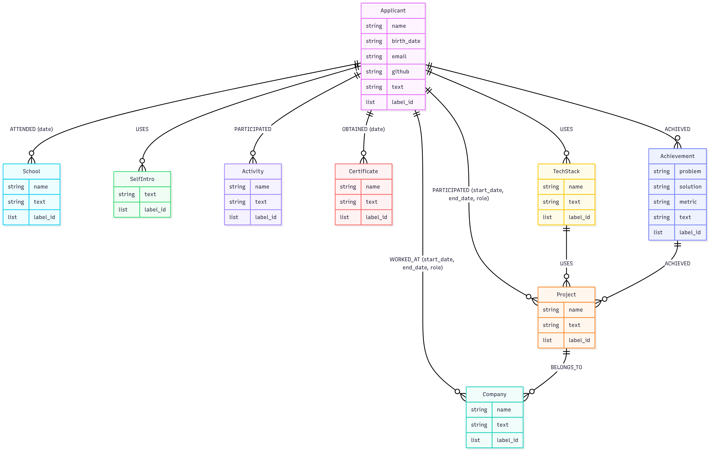

# 그래프 RAG 설계

본 문서는 현재 프로젝트의 그래프 기반 RAG(Graph RAG) 설계 과정을 설명합니다.

### 벡터DB의 문제점과 그래프DB의 장점

- 벡터DB로 구성된 RAG는 사용자의 질문을 유사도 검색을 통해 관련 컨텍스트를 청크로 가져옵니다.  

**벡터DB 문제점 1.**
- 질문에 알맞는 청크의 갯수를 선정하는 것이 어렵습니다. 항상 질문이 하나의 청크에 관련된 것만은 아니기 때문에, '진행한 프로젝트들 다 알려줘'라는 질문에 대답하기가 어렵습니다. 선택하는 컨텍스트의 절대적인 갯수를 늘려서 처리하는 것은 토큰 비용을 과도하게 증가시킵니다.   

**벡터DB 문제점 2.**
- 질문에 대한 유사도 검색으로 관련 컨텍스트를 읽어오기 때문에 의미론(semantic)적인 정보를 놓칠 수 있습니다. 예를 들어, 'AOS 알파'라는 프로젝트가 있을 때, 청크에 '프로젝트'라는 키워드가 포함되어있지 않으면, 유사도 검색에서 순위가 밀릴 수 있습니다.  

그래프DB는 올바른 쿼리가 주어진다면, 그에 알맞는 컨텍스트를 유연하게 여러 개 가져올 수 있고(예를 들어, '프로젝트'를 질의했을 때, '프로젝트' 노드를 선택하여 읽어오는 식으로 컨텍스트 갯수를 유연하게 선택할 수 있습니다), 구조화된 정보 저장을 통해 의미론적인 정보를 더 잘 파악할 수 있습니다(청크에 '프로젝트'라는 키워드가 포함되어있지 않더라도, '프로젝트' 노드를 선택하여 읽어오면 의미론적으로 가장 관련된 맥락을 가져올 수 있습니다).

### 데이터 모델링

- 사용자의 질문에 적합한 쿼리 생성을 위해 데이터 모델링을 먼저 수행해야합니다.
- 이력서의 섹션을 SelfIntro, School, Certificate, TechStack, Company, Project, Activity, Achievement 노드와 ATTENDED, USES, WORKED_AT, PARTICIPATED, BELONGS_TO, ACHIEVED 관계로 나누었습니다.

### 그래프DB 동작 방식 - Text2Cypher
- 그래프 DB를 활용하는 방식에는 여러 가지가 있겠지만, 제가 선택한 방식은 llm으로 사용자의 질문을 cypher(그래프 DB 쿼리문)로 변환하는 방식이였습니다. 

### 그래프DB + Text2Cypher 성능
Text2Cypher 구현. 성능: F1 score {}%

### (그래프DB + Text2Cypher)의 단점
- Text2Cypher를 사용하면서 제가 파악한 그래프 DB의 단점은 엔티티 이름이 정확하지 않을 경우, 쿼리 결과가 나오지 않을 수 있다는 점입니다. 예를 들어서, 회사 이름 'AgileSoda'를 한글 '애자일소다'로 입력해서 질의할 경우, text2cypher 쿼리문이 `MATCH (Company:c) WHERE c.id="애자일소다"`로 처리되면서 쿼리 결과가 아무것도 나오지 않게 됩니다.

이 문제는 텍스트 임베딩을 적용해서 해결할 수도 있겠지만, 저는 GraphDB에 저장된 노드 엔티티 값들을 프롬프트에 넣어서 사용자의 질문에 포함된 엔티티가 올바르게 매핑될 수 있도록 수정해서 해결했습니다. 사용한 문서가 이력서라는 점에서 노드가 많아봤자 100개 내외 정도이기 때문에 사용자의 질문에 매번 유사도 검색을 하는 것보다 더 나은 선택이라고 판단했습니다.

매번 쿼리 결과가 다르게 나오는 문제
https://neo4j.com/blog/developer/langchain-cypher-search-tips-tricks/ 참고해보자.
